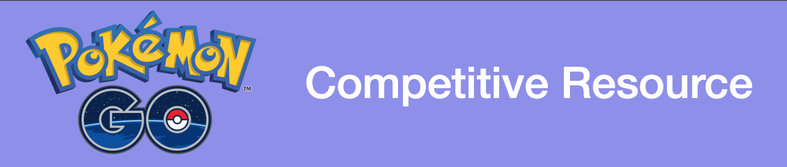
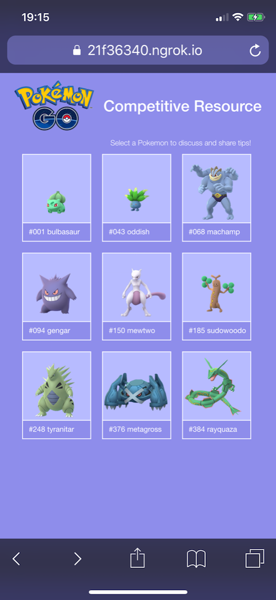
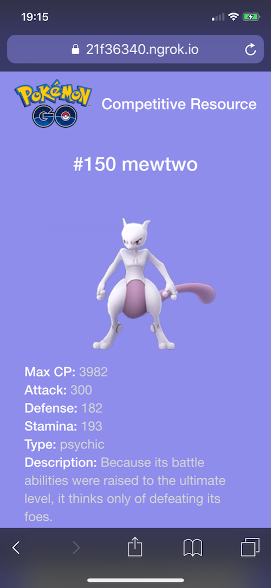
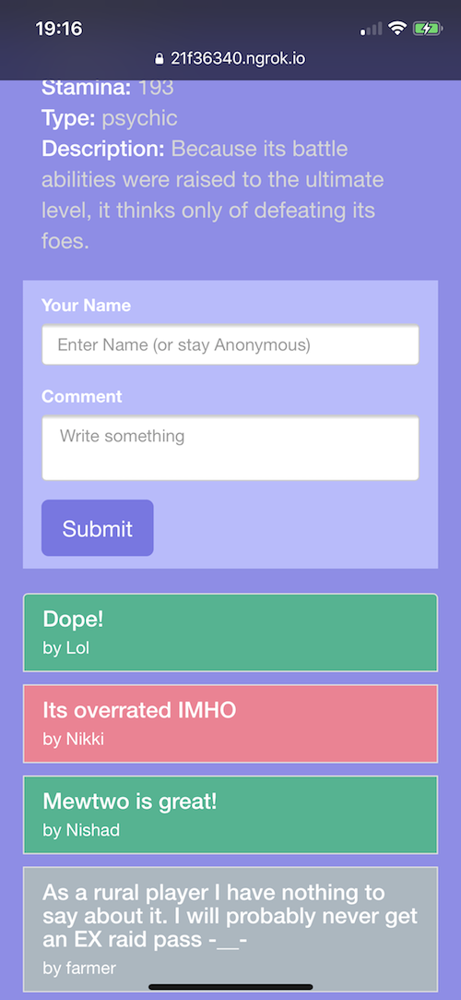

# PokemonGo Competitive Resource

## This website allows users to discuss pokemon stats and competitiveness in an organized fashion.

|          Index Page             |  One Pokemon                       |    Comments Reflect Sentiment  |
|---------------------------------|----------------------------------|---------------------------------|
|  |  | |

## Getting started

#### Step 1 
Run the Ruby on Rails Data API server. More details in [Backend API README](backend/pokemonGoComp/README.md)

#### Step 2
Run the Node/Express Frontend server. More details in [Frontend README](frontend/README.md)

## Authors

- [Nishad Shaker](https://github.com/NSharker), Ruby on Rails Guru
- [Nikki Jack](https://github.com/Nukki), MERN Stack Ninja
